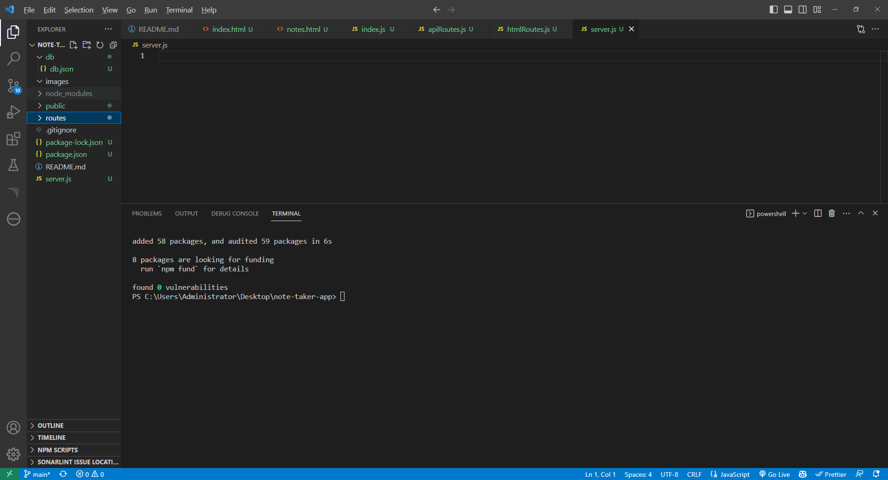
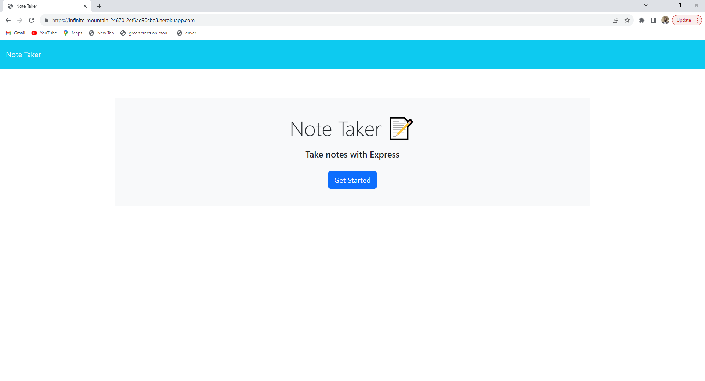
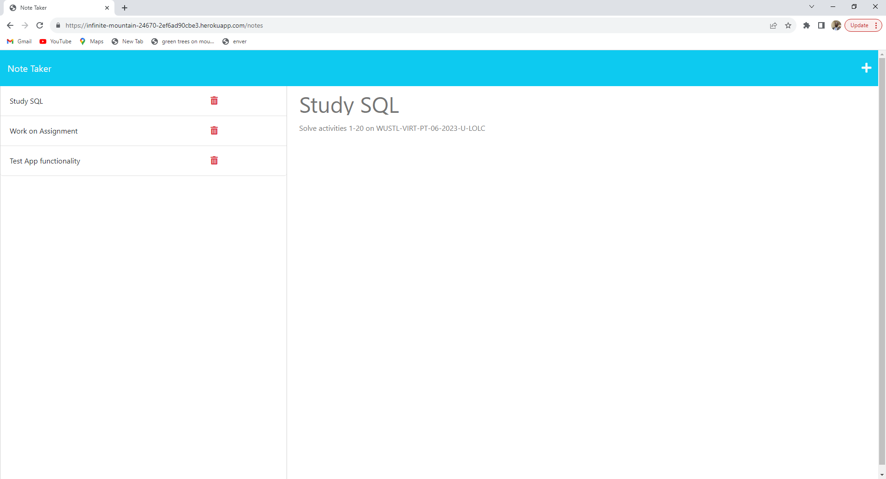
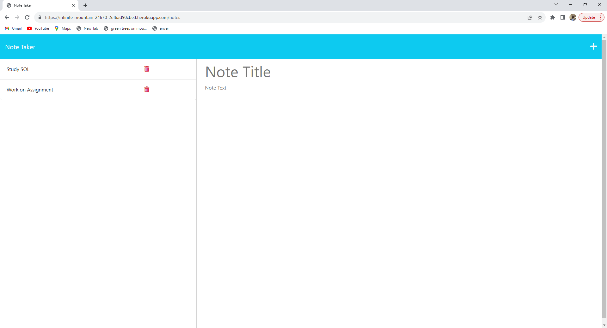

<h1 align="center"> Note Taker App Using Express.js 👋</h1>
  
<p align="center">
    
    
    
    
    
</p>

## Description

[](https://opensource.org/licenses/MIT)

Note Taker is a user-centric note-taking application designed to cater to the specific needs of small business owners. This app simplifies the process of capturing ideas, managing tasks, and staying organized in the dynamic world of entrepreneurship. With its intuitive interface and essential features, Note Taker becomes an indispensable tool for boosting productivity.

## Table of Contents

- [Description](#description)
- [Table of Contents](#table-of-contents)
- [Key Summary Features of this App ](#table-of-contents)
- [Installation](#installation)
- [Usage](#usage)
- [Testing](#testing)
- [Contributing](#contributing)
- [Questions](#questions)

## Key Summary Features of this App:

Here are the key features of a Note Taker App using Express.js summarized in 6 bullet points:

1. **Simplified Start:** The moment you launch Note Taker, you're greeted by a well-structured landing page. A prominent link on this page seamlessly guides you to your notes, setting the stage for efficient note management.

2. **Effortless Note Creation** As you access the notes page, you'll find a well-arranged layout. Existing notes are showcased in the left column, while the right column offers a straightforward interface for crafting new notes.

3. **Instant Saving:**Begin typing a new note's title and content, and watch as the Save icon elegantly appears in the top navigation. This instant feedback assures you that your work is secure. A simple click on the Save icon stores your note for future reference alongside your other notes.

4. **Organized Insights::** Your notes are elegantly displayed in the left-hand column, fostering an environment of organization. Note Taker enables you to categorize, search, and manage your notes with ease, ensuring no valuable insight gets lost.

5. **Quick Access:** Click on any existing note in the left column, and it promptly appears in detail in the right-hand column. This quick access facilitates seamless reviewing, editing, and updating of your notes.

6. **Swift New Note Creation:** When creativity strikes, the Write icon in the navigation bar provides immediate access to a blank note. Quickly document your ideas without disrupting your workflow.

**Motivation**
The inspiration behind creating the "Note Taker" app as a bootcamp student stems from recognizing the specific needs of small business owners. Interacting with entrepreneurs revealed their struggle to manage tasks and ideas effectively. Witnessing their challenges in multitasking and staying organized, I felt compelled to contribute to their success. This led me to conceive the "Note Taker" app, tailored to their requirements, aiming to simplify note-taking and organization. It's a product of empathy, combining my passion for technology with a practical solution to empower entrepreneurs in their dynamic roles.

1. **Empowering Entrepreneurs:** Small business owners are the backbone of our economy, and I wanted to empower them with a tool that simplifies their day-to-day operations. By providing an intuitive note-taking platform, I aimed to alleviate some of their organizational challenges and contribute to their overall efficiency.

2. **Addressing a Specific Need:** Through research and conversations with entrepreneurs, I recognized that while there are numerous note-taking apps available, there was a gap for a solution specifically designed for small business owners. This motivated me to create an application that caters to their unique demands and helps them stay focused on growth.

3. **Hands-On Learning: :** As a bootcamp student, I recognized the value of practical, hands-on experience. Developing the "Note Taker" app allowed me to apply my coding skills and gain experience in designing user-friendly interfaces, managing data, and implementing essential features. This project provided an opportunity to bridge the gap between theory and real-world application.

4. **Problem-Solving and Innovation::** Creating the "Note Taker" app challenged me to think critically and innovate. I had to consider user experience, data security, and seamless functionality while designing the app. This experience honed my problem-solving skills and encouraged creative thinking.

5. **Portfolio Enhancement:** As a bootcamp student looking to transition into a career as a developer, having a polished project like the "Note Taker" app in my portfolio showcases my practical skills to potential employers. It demonstrates my ability to create a functional and user-centered application from scratch.

In conclusion, the "Note Taker" app was born out of a genuine desire to contribute to the success of small business owners while honing my technical skills. This project allowed me to combine empathy, innovation, and learning in a way that I believe will make a positive impact on entrepreneurs' lives while setting a strong foundation for my career in technology.

## Installation

To install and use the README generator program, follow these steps:

1. **Clone the Repository:**
   Open your terminal and navigate to the directory where you want to install the Note Taker App. Then, run the following command to clone the repository:

   ```
   git@github.com:abdulsamedtma/note-taker-app.git
   ```

2. **Navigate to the Project Directory:**
   Move into the project directory using the `cd` command:

   ```
   cd note-taker
   ```

3. **Install Dependencies:**
   Install the required dependencies by running:

   ```
   npm install
   ```

By following these steps, you'll successfully install and use the README generator program to create a well-structured and informative README for your projects..



## Usage.

Click: <a href="https://infinite-mountain-24670-2ef6ad90cbe3.herokuapp.com"> Note Taker App</a>

It will launch the app on your browser ready for use !







## Testing

💻
Once all the packages have been installed, open terminal and run the following code in command line :
node server.js
This will run the server where you can find the page on localhost:3001. To end your server in your terminal type: control + c

## Credit

N/A.

## License

NOTICE: This application is covered under the MIT License

## Permission is hereby granted, free of charge, to any person obtaining a copy

## How to Contribute

Open to collaboration, if you choose to do so open an issue and modify any changes you would like to see on a feature branch and wait for approval before merging to the main branch.
Contributions are always welcome! But please read the contribution guidelines first on [Contributor Covenant](https://www.contributor-covenant.org/).

## Questions

Have additional questions? Click the links below to reach me through my GitHub account or Email address.

[Link to Github](https://github.com/abdulsamedtma)

<a href="mailto:abdulsamedtma@gmail.com">Connect with Abdul via Email</a>

Click: <a href = "https://github.com/abdulsamedtma/note-taker-app"> Repository URL </a>

Click: <a href="https://infinite-mountain-24670-2ef6ad90cbe3.herokuapp.com"> Deployed App on HEROKU </a>

                  This Note Taker App was created with ❤️ by Abdul. ✨  Every day is a learning day!  ✨
